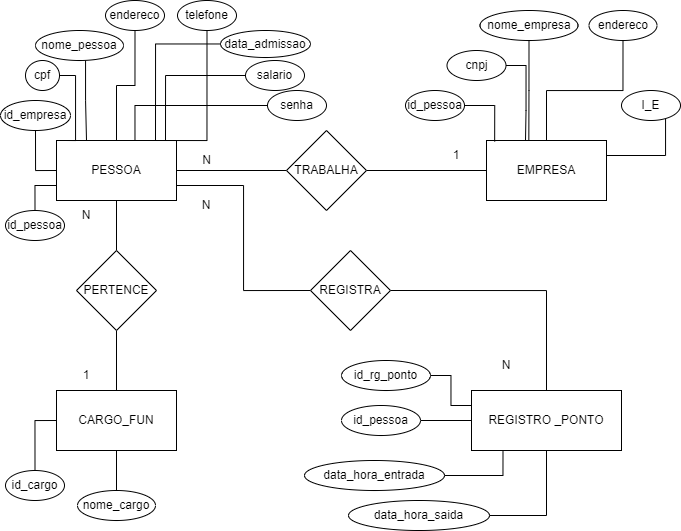

# Grupo Projeto Final de Banco de Dados

## *Projeto final*!  
Desenvolva um projeto em equipe (tema livre) que aplique todo o conteúdo deste módulo.  
Banco de Dados (defina um modelo de dados consistente com sua aplicação) Scripts de inicialização dos dados:  
* Defina um arquivo data.sql para realizar os inserts iniciais da aplicação.  
* Crie um arquivo README.md explicando o escopo do seu projeto e adicione os diagramas que vier a criar.  
* Aplicação Spring usando JPA para comunicar com o banco de dados.  
* Seu banco de dados deve definir mais de uma tabela, relacionamentos e constraints.  
* Defina pelo menos um CRUD (create-read-update-delete).  

Nosso projeto será uma aplicação de *Controle Registro de Ponto*  

Haver√° as seguintes tabelas:  
* _Pessoa_
* _Empresa_
* _Cargo_
* _Registro_Ponto_

### *MER*

Autores:  
JosÈ Pires.  
Gabriel Galv„o.  
Luan Ramalho.